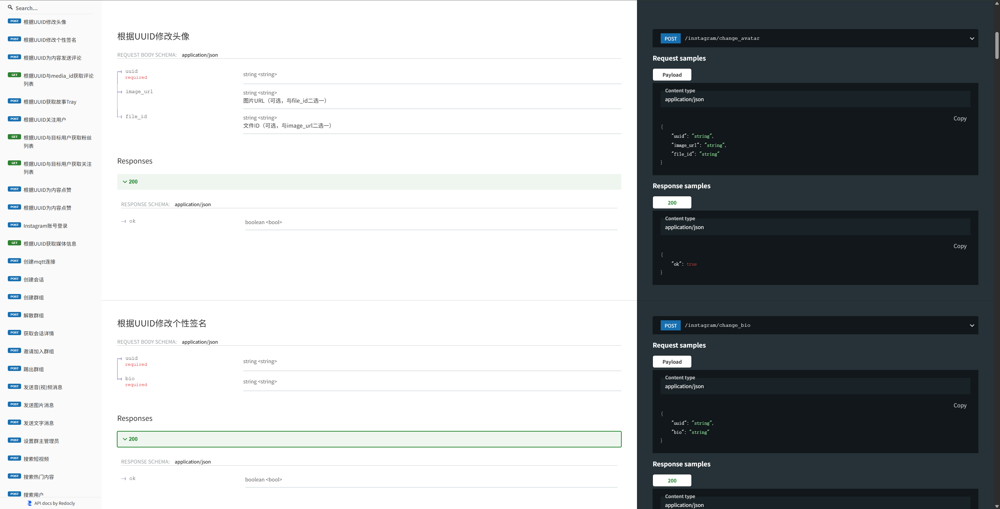

# Instagram iOS 私有API (V397.1)

## 概述

本仓库包含了针对 Instagram iOS V397.1 的全面私有 API 实现。该 API 提供了对 Instagram 功能的程序化访问，使开发者能够构建高级自动化工具和应用程序。

Instagram 397.1.0.38.81 (iPhone10,6; iOS 16_6_1; en_US; en; scale=3.00; 1125x2436; 790717060) AppleWebKit/420+
23966c53a485abc8a46056e59953606212796f430df44d03b1024a9403373fd7
124024574287414

### Instagram SSL Pass
- Android_InstagramSSLPinningBypass-v399.js 兼容Android 397 398 399
- fucker_ssl_v397_iphoneos-arm64.deb 只支持Ios 397 

- Ins_v405.1_ssl_pinning_iphoneos-arm64.deb  支持到Instagram  v405.1
  - ### 最新版V405 Instagram Private Api 即将发布，欢迎大家测试

###  无限注册方式请参考以下邮箱注册演示部分

**API 文档地址**: https://api.**********.com/swagger/#tag/Instagram

## 功能特性

该私有 API 实现支持广泛的 Instagram 操作：

### 用户管理
- 用户身份验证和会话管理
- 用户资料信息检索
- 用户搜索和发现
- 关注/取消关注用户
- 用户关系状态检查

- [新增] 设置链接
- [新增] 检查用户名
- [新增] 设置用户名
- [新增] 设置全名

### 内容操作
- 动态浏览和检索
- 帖子创建（照片、视频、相册）
- 帖子删除和归档
- 快拍查看和创建
- IGTV 内容管理
- Reels 互动

### 互动功能
- 点赞/取消点赞帖子
- 评论帖子
- 私信（DM）
- 快拍回复
- 收藏/取消收藏帖子

### 发现与探索
- 探索页面访问
- 话题标签搜索和浏览
- 基于位置的内容发现
- 推荐用户和内容

### 分析与洞察
- 账户统计数据
- 帖子表现指标
- 粉丝/关注列表
- 快拍洞察

### 群聊功能
- 创建群聊
- 邀请入群
- 设置群管理员
- 剔除群聊

## 身份验证

API 使用基于会话的身份验证，模拟官方 Instagram iOS 应用（V397.1）。身份验证通常包括：

1. **登录**：使用 Instagram 凭据进行身份验证
2. **会话管理**：维护会话令牌用于后续请求
3. **设备模拟**：API 模拟真实的 iOS 设备请求以避免被检测

## API 端点概览

完整的端点文档请参考

## 速率限制

为防止被检测和账户限制，请自行实施速率限制：

## 最佳实践

### 1. 会话管理
- 安全存储会话令牌
- 实施会话刷新逻辑
- 优雅地处理会话过期

### 2. 错误处理
- 始终检查响应状态码
- 实施带指数退避的重试逻辑
- 记录错误以便调试

### 3. 速率限制遵守
- 尊重速率限制以避免账户被标记
- 为批量操作实施队列机制
- 在请求之间添加随机延迟（模拟人类行为）

### 4. 设备一致性
- 每个账户使用一致的设备 ID
- 跨会话维护设备指纹
- 模拟真实的设备元数据

## 安全注意事项

⚠️ **重要安全提示：**

1. **账户安全**：使用私有 API 可能违反 Instagram 的服务条款。使用风险自负。
2. **凭据保护**：切勿硬编码凭据。使用环境变量或安全存储。
3. **仅使用 HTTPS**：始终使用 HTTPS 进行 API 通信。
4. **令牌安全**：安全存储会话令牌，切勿在客户端代码中暴露它们。
5. **IP 轮换**：考虑对分布式操作使用代理以避免基于 IP 的检测。

## 版本兼容性

- **Instagram iOS 应用版本**：V397.1
- **API 基础**：模拟官方 Instagram iOS 端点
- **签名算法**：与 V397.1 请求签名兼容

## 限制

- 某些功能可能会根据账户类型（个人 vs 商业）受到限制
- 某些操作需要已验证的账户
- 速率限制因账户年龄和活动历史而异
- 随着 Instagram 更新其平台，某些端点可能会被弃用

## 支持与文档

- **完整 API 文档**：https://api.************.com/swagger/#tag/Instagram
- **问题追踪**：通过 GitHub Issues 提交问题
- **更新**：定期检查 API 更新，因为 Instagram 会更改其平台

## 免责声明

这是一个用于教育和研究目的的私有 API 实现。使用此 API 可能违反 Instagram 的服务条款。开发者不对使用此 API 导致的任何账户限制、封禁或其他后果负责。请始终确保遵守 Instagram 的政策和当地法规。

---

**注意**：此 API 基于 Instagram iOS V397.1 的逆向工程。随着 Instagram 更新其平台，端点和功能可能会发生变化。请始终参考 [Swagger 文档](https://api.************.com/swagger/#tag/Instagram) 以获取最新的 API 规范。

该视频详细展示了邮箱注册的完整流程，帮助您快速上手。

## 联系方式

如果您有任何问题、建议或需要技术支持，请通过以下方式联系我：

📱 **Telegram**: [@Eric](https://t.me/Eric0528)

---

  
⭐ 如果这个项目对您有帮助，请给个 Star ⭐

